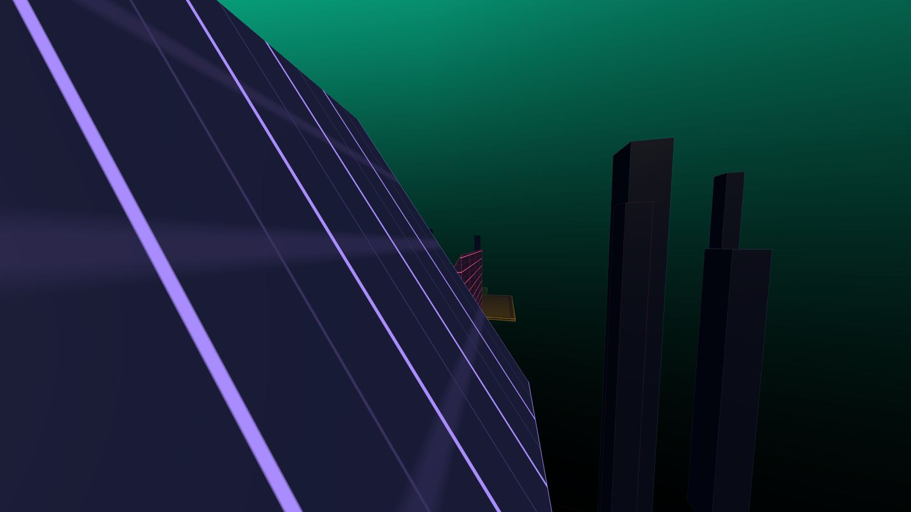
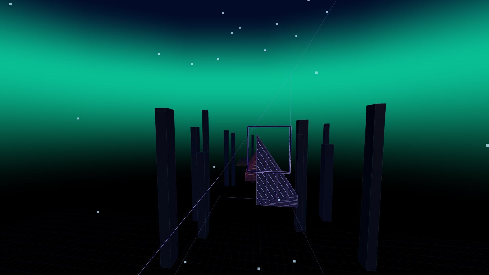
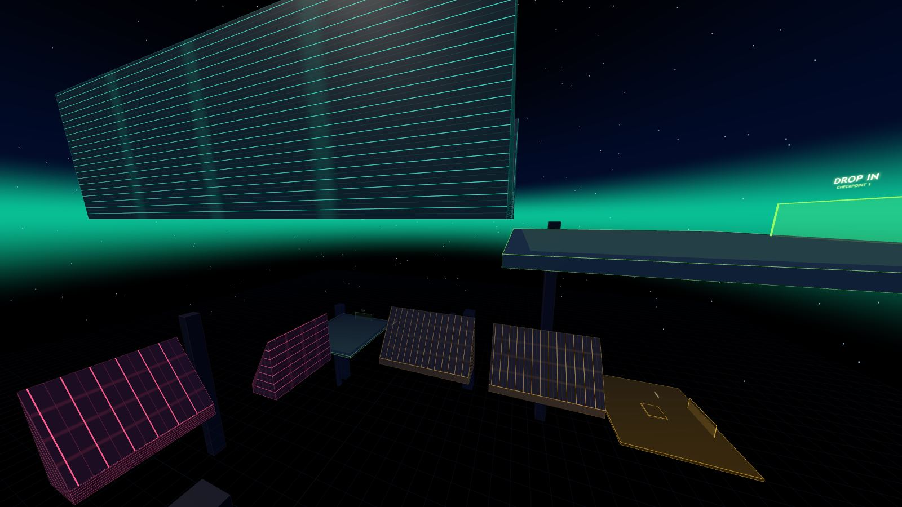

# surf

Browser **CS surf**. Source-engine movement, ported faithfully and run by hand — no auto-strafe,
no speed multipliers, no assists. Two courses:

| | |
|---|---|
| **Surf AirCtrl** (`surf_aircontrol`) | One shot, six ramps, **no checkpoints**. Timer-server rules: no bhop gain, 350 prespeed. The flights between the ramps are the map. |
| **Surf Helix** (`surf_helix`) | Five stages, four checkpoints. Falling costs you the clock, not the run. |

**[▶ Play them here](https://neomorrison.github.io/surf/)**



It is served as ES modules, so it has to come over **HTTP** (modules will not load from `file://`):

```bash
python3 -m http.server 8137
```

Then open <http://localhost:8137/>.

## What surfing actually is

A surface in Source is standable only if its normal points up by at least `0.7` — about
**45.57°**. Steeper than that and the engine refuses to make it your ground:

```js
export function findGround(x, z, lo, hi, radius) {
  ...
  for (const r of RAMPS) {
    if (!r.walkable) continue;          // <- the entire game is this line
```

That one exclusion is the whole mechanic. You do not land on a surf ramp; you are permanently
airborne next to one. Every tick, three things happen:

1. **Gravity** pulls you into the face.
2. `ClipVelocity` deletes *only* the component of your velocity going into the plane, and leaves
   everything travelling along it. The in-plane part of gravity survives, so you accelerate down
   the slope.
3. **`AirAccelerate` runs** — because you are airborne — and that is the only input you control.

```js
const wishspd = Math.min(wishspeed, 30);      // sv_airaccelerate's target cap
const currentspeed = vel.x * wx + vel.z * wz;
const addspeed = wishspd - currentspeed;
if (addspeed <= 0) return;                    // already faster than 30 that way: nothing
```

The speed you are allowed to *aim for* along the direction you are holding is clamped to
**30 u/s**, but the rate you accelerate toward it is not. So holding **W** does nothing once you
are moving forward faster than 30. The only wish vector that pays is one held nearly
*perpendicular* to your velocity — and to keep it perpendicular while your velocity rotates, you
have to keep turning the mouse. Hold **A** and swing left, or **D** and swing right, for the
entire length of the ramp.

Two consequences fall straight out of the arithmetic, and both are measured in
[`test/movement.test.mjs`](test/movement.test.mjs):

- The per-tick ceiling is `sqrt(v² + 30²) − v`. That is **191 u/s per second** at 300 u/s and
  **64 u/s per second** at 900. A run is a grind, not a switch you flip.
- Only the *in-plane* part of a horizontal wish vector survives the clip, and that part is
  `cos(angle)` of it. A rider who refuses to give up any height therefore gains fastest on the
  **shallowest** ramp. Steep ramps are not fast because of the angle — they are fast because of
  the height they let you spend:

```
  angle   speed after 1s   3s     5s     8s
   50deg    425    591    722    884
   54deg    410    577    704    862
   58deg    406    559    675    824
   62deg    402    547    663    805
```

Sliding off the low edge is a fall. Holding a line is the skill.

## The surf-server rules

Every course plays by the same movement rules, the way every map on a given server does. They live
in `RULES` in [`src/config.js`](src/config.js) — not in map data, because `physics.js` deliberately
imports nothing but `config.js` and the rulebook must not be able to reach into a map.

**Bunnyhopping off.** With `sv_enablebunnyhopping 0`, Source's `PreventBunnyJumping()` scales your
velocity back to `BUNNYJUMP_MAX_SPEED_FACTOR` (1.2) times `m_flMaxspeed` on the tick you jump —
300 u/s with a knife:

```js
if (!RULES.bunnyhopping) {
  const cap = M.maxSpeed * M.bunnyhopFactor;             // 250 * 1.2 = 300
  const spd = Math.hypot(vel.x, vel.y, vel.z);           // the engine uses the 3D length
  if (spd > cap) { const k = cap / spd; vel.x *= k; vel.y *= k; vel.z *= k; }
}
vel.y = M.jumpVel;                                       // the kick lands after the clamp
```

260 u/s stays 260, but 500, 900 and 1500 all come out at exactly 300. Note where the check sits: it
needs `onGround`, and a surf ramp is never ground, so it can never touch you mid-ride.

**Prespeed capped at 350 in the start zone.** This one is *not* an engine cvar — prespeed limits
are a timer-plugin feature and the number is a server's choice, with 300–350 the usual range on
surf. It is enforced continuously while you are inside the zone.

The subtlety is where the zone stops. A cap that covers only the platform is worth nothing: the
gap between it and the first ramp is free air, and a perfect strafe turns 170 units of it back into
60 u/s. The first version of this leaked exactly that way — the cap said 350 and you touched ramp
one at **411**. So the zone is built from the geometry rather than typed in:

```js
export function prespeedZone(o = {}) {
  const first = MAP.route[0];                 // the first point on the ride line
  ...                                         // spanned from the spawn, and 260 past it
}
```

`test/bot.test.mjs` then attacks it rather than trusting it — it runs up to walking speed, holds a
frame-perfect hop and a perfectly perpendicular wish all the way in, and asserts what arrives:

```
  course            best anywhere   at the first face
  surf_aircontrol          350 u/s            350 u/s
  surf_helix               350 u/s            326 u/s
```

**Ground and air acceleration** are the values surf servers actually run: `sv_accelerate 10` and
`sv_airaccelerate 150`. Anything above about 16 of air acceleration saturates against the 30 u/s
wish cap on every tick, so the exact number changes nothing — the cap is the game.

## The collision, exactly

A ramp is a yaw-rotated wedge: a footprint rectangle with a top face that slopes across it. That
makes it one plane plus a boundary, so the collision is exact rather than a stack of special
cases. The player hull is an axis-aligned square with its bottom at the feet, and the plane
normal always points up, so the deepest corner of the hull is always a bottom one:

```js
function rampDist(r, x, feetY, z, radius) {
  const n = r.n;
  const d = n.x * (x - r.cx) + n.y * (feetY - r.yMid) + n.z * (z - r.cz);
  return d - radius * (Math.abs(n.x) + Math.abs(n.z));   // exact, not an approximation
}
```

Negative means penetrating; push out along `n` by that much and call `ClipVelocity`. At 128Hz the
penetration each tick is the 6.25 u/s of gravity added that tick, or about **0.05 units** — which
is why the ride is smooth and why `test/movement.test.mjs` can assert the hull sits within a
fraction of a unit of the plane rather than hovering or sinking. Movement is integrated in all
three axes at once and sub-stepped to at most 7 units per collision pass, so a hull doing 1,900
u/s never skips through a face.

## The courses

Both maps are generated from a **ride line**, not from coordinates. The cursor in
[`src/mapkit.js`](src/mapkit.js) tracks where a player is expected to actually *be* — a point
part-way up a face — and every piece is hung off that. Air sections are authored ballistically:

```js
gap(700, 760);      // 700 units of air at 760 u/s -> drops the cursor 339 units
```

so the next ramp gets placed under wherever that really puts you. That is why the drops line up
instead of needing to be nudged by hand.

### surf_aircontrol

An air-control course in the tradition of the KSF-timer air_control maps: a single unbroken run
down one corridor where the ramps are generous and the *flights between them* are the difficulty.
It is an original course built to that shape — not a port of any existing community map, and it
shares no geometry with one.

The start platform ends 170 units short of the first face and 171 units above it, so you walk off
the lip and you are already surfing. After that, every flight asks for more speed than the last
and moves you further sideways than the last:

```
  flight    span   sideways    drop    needs
            904        420     666      700 u/s
           1103        560     723      820 u/s
           1293        680     790      920 u/s
           1484        800     881     1000 u/s
           1664        900     950     1080 u/s
           1200          0     436     1150 u/s
```

The sideways column is the whole point. A flight that only goes forwards is a wait; one that also
goes 900 units left has to be *steered*, and steering in the air is the same 30 u/s wish cap doing
a different job. Two of the flights drop a frame on the ride line at their midpoint — something to
aim at, deliberately **not** solid. A wall you have to thread is the obvious way to test air
control, but the honest punishment for a bad line already exists: you arrive at the next ramp off
to one side and slide off it. Adding an instant death on top of that, in a map with no
checkpoints, at a position the generator can only estimate because it cannot know how early you
will start your turn, would be punishing you for its arithmetic rather than for your flying.

The flights are also kept short in *time* on purpose. Drop follows from hang time, so a long
lazy flight would turn the map into a drop tower and hand you speed that gravity earned instead
of you — the first draft descended 10,000 units and peaked at 2,400 u/s doing exactly that.



### surf_helix
Five stages spiralling 5,800 units down through the void, each ending on a catch pad with a
checkpoint.

```
  stage          ramps   angles      enters at   leaves at   kill floor
  DROP IN           2   52                0        -460        -1316
  SWITCHBACK        4   55             -616       -2071        -2927
  THE BEND         22   54            -2227       -2707        -3563
  THE GAP           4   58            -2863       -4868        -5724
  THE SPINE         2   60            -5024       -5266        -6555
```

- **1 · DROP IN** — a trough with a floor for the first third. Walk it and friction pins you at
  250 for ever; strafe into either wall and you are surfing. The floor runs out well before the
  stage does.
- **2 · SWITCHBACK** — single faces with void on both sides, leaning the other way each time.
  Every transition is a real flight onto a ramp already tilted against you.
- **3 · THE BEND** — a trough that turns ninety degrees in ten steps. Straight-line strafing dies
  here: the wall rotates out from under your velocity and you have to keep turning with it.
- **4 · THE GAP** — steep, short faces with up to 1,050 units of air between them. Nothing catches
  you; the only thing that crosses the hole is speed you already had.
- **5 · THE SPINE** — one 60° face, seven thousand units long, with no wall opposite to save a bad
  line.

Each stage ends on a catch pad big enough to collect a player arriving anywhere from the floor to
a thousand units up, with a checkpoint that spans it. Falling does not end a run — you go back to
the last checkpoint and **the clock keeps going**, which is the only punishment a surfer respects.



## The course is proved runnable, not assumed to be

[`test/surfbot.mjs`](test/surfbot.mjs) is a headless surfer that plays by exactly the rules a
human has: one strafe key at a time, and a mouse limited to 3.8 rad/s. Its whole controller is two
rules — aim the wish vector perpendicular to your velocity, and pick the side that either moves
you toward 45% up the face (damped by how fast you are already climbing, or it chatters off the
plane) or rotates you toward where you have to land. Perpendicular is provably optimal, so where
the bot fails, the course is at fault.

It plays `surf_helix` a stage at a time, from a standing start on the checkpoint you would
respawn at, and `surf_aircontrol` in one piece with nothing to fall back on:

```
  surf_helix
  leg             result           time   peak u/s   on-ramp   mouse
  DROP IN        cleared           50.6s       790       48%   3.8 rad/s
  SWITCHBACK     cleared           21.6s      1186       56%   3.8 rad/s
  THE BEND       cleared           17.4s      1096       65%   3.8 rad/s
  THE GAP        cleared           17.4s      1183       46%   3.8 rad/s
  THE SPINE      cleared           16.4s       949       54%   3.8 rad/s

  surf_aircontrol
  leg             result           time   peak u/s   on-ramp   mouse
  START→FINISH   cleared           25.5s      1998       48%   3.8 rad/s

  surf_helix full course: FINISHED in 90.1s, peak 1954 u/s, 50% of it on a ramp
```

Every one of those numbers was a failure first. The bot is what found that `high: 'L'` was
building ramps leaning the wrong way, that stage-entry ramps were poking through the previous
stage's catch pad, that a trough entered from a ledge needs its face hung under the ledge rather
than five hundred units above it, and — on the new map — that solid threading walls were a trap
the generator could not place fairly.

```bash
npm test                      # 29 tests: movement, maps, bot
npm run trace aircontrol      # tick-by-tick trace of the bot flying the whole one-shot map
npm run trace helix 3         # or one stage of the other course
```

`test/trace.mjs` is the tool both courses were tuned with — it prints speed, height, which face
the bot is on and how far up it, every N ticks. The map tests also assert things the eye misses:
that no kill volume swallows the ride line it is supposed to be protecting, that the prespeed zone
actually covers the spawn and reaches the gate, and that the start platform really is next to the
first ramp.

## On screen

There are no speed lines, no camera lean, and the field of view does not widen with speed. All
three are things moving in the frame that are not the ramp: a FOV that opens with speed shifts the
ramp edge under your crosshair mid-line, and a horizon that tips when you press a key is one more
thing to read past. What is left is instrumentation:

- **Speedometer** — the scoreboard. The tick on the bar is 250 u/s; everything past it you
  strafed for.
- **Ramp gauge** (left) — how much face is still under you. 0% is the low edge you are about to
  slide off. On a ramp you cannot see the horizon, so this is the only altimeter you get.
- **Strafe sync** — this tick's gain against `sqrt(v² + 30²) − v`, the best a perfect wish vector
  could have done. A readout, never an input.
- **Key display** — a strafe key held with no turn goes red. That is the classic beginner mistake
  and it is worth being told about.
- **The ghost** — your own personal best, recorded at 16Hz and replayed alongside you.
- **The trail** — a dot dropped on the face a few times a second while you ride. The line it
  leaves is your own racing line, which is the most useful thing you can look at on a second
  attempt down the same ramp.

## Controls

| | |
|---|---|
| `W A S D` | move |
| Mouse | look |
| `Space` / wheel | jump — on flat ground only; a ramp is never ground |
| `Ctrl` / `C` | duck |
| `R` | restart the run |
| `Q` | back to the last checkpoint |
| `Tab` | records |
| `Esc` | settings and stage select |
| `F1` | auto-hop · `F2`/`F3` key and sync display |

Auto-hop answers *when*, never *where*, and it does nothing on a ramp.

## Layout

```
index.html            HUD markup, panels, map picker, importmap
src/config.js         the movement CVars, the server RULES, the persisted settings
src/physics.js        collision volumes + PlayerMove. No THREE, no DOM, unit tested headless
src/world.js          builders: each emits the mesh AND the matching physics volume
src/mapkit.js         the ride-line authoring language every course is written in
src/maps/*.js         the courses themselves
src/map.js            the registry: which course is currently built
src/player.js         view angles, eye smoothing (no roll: the horizon stays level)
src/input.js          pointer lock; per-frame mouse split evenly across the frame's ticks
src/timer.js          run state, splits, per-map records, the personal-best ghost
src/hud.js            speedometer, ramp gauge, sync, splits, panels
src/fx.js             rings, the ramp trail, the ghost mesh
src/audio.js          synthesised — no sample files
src/core.js           renderer, sky, starfield, lighting
src/main.js           boot, the 128Hz loop, triggers, menus, the map picker
test/                 movement, map and bot tests + the trace tool
```

`src/physics.js` deliberately imports nothing but `config.js` — not even the map. That is why the
server rules live in `config.js` as a `RULES` object a map *applies* rather than as map data the
rulebook reads: the renderer cannot reach into the movement, and the movement can be run without a
browser at all, which is what makes the bot possible.

`MAP` is repopulated in place rather than replaced when you switch courses, so every module can
import it once and keep the binding.

The simulation is a hard 128Hz whatever the display is doing, and each frame's mouse movement is
split evenly across that frame's ticks. Air acceleration is a per-tick sum and a surf ramp is
twenty unbroken seconds of it, so this is the difference between a 60Hz machine and a 240Hz one
gaining the same speed and not.

## Attribution

Original game. The movement reproduces the Source-engine model — friction, ground acceleration,
the 45.57° standable-surface threshold, the 30 u/s air wish-speed cap and the 1.2× bunnyhop cap —
from public documentation. All geometry, art and code are original and no Valve assets are used.

`surf_aircontrol` is named for, and built to the shape of, the air-control genre of surf maps. It
is not a port of any existing community map and shares no geometry with one. The map the genre is
named after, `surf_air_control` / `surf_aircontrol_ksf`, is by **SnoopSh** (2012) — a tier-1,
five-checkpoint map with two bonuses — and this is not a reproduction of it.

The module layout and renderer skeleton follow
[neomorrison/bhop](https://github.com/neomorrison/bhop); the ramp solver, the map generator, the
bot and both courses are this project's own.

MIT.
